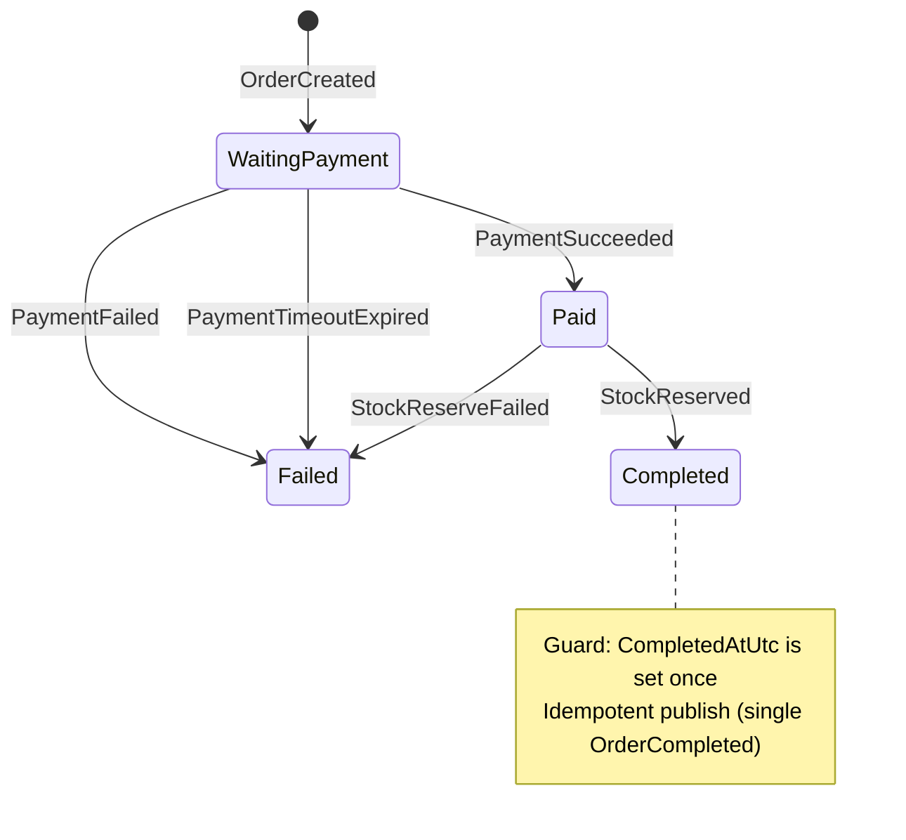

# OrderFlow

A complete end-to-end demo showing event-driven order orchestration with MassTransit Sagas, tracing, and fault-tolerant workflows.

## Architecture
- Orchestrator: MassTransit saga state machine (EF-backed) driving the order lifecycle
- OrderService: API for basket/checkout + order read model
- PaymentService: Takes payment, handles refunds
- StockService: Reserves stock
- EmailWorker: Sends receipt email (optional for completion)
- Gateway: YARP reverse proxy and rate limiting, trace root
- BankMock: Simulates external bank API
- Infra: RabbitMQ, Jaeger, Prometheus, Grafana, OTel Collector

## General flow
1) UI triggers checkout via Gateway → OrderService
2) OrderService publishes `OrderCreated`
3) PaymentService charges via BankMock → publishes `PaymentSucceeded`/`PaymentFailed`
4) StockService reserves stock → publishes `StockReserved`/`StockReserveFailed`
5) EmailWorker sends receipt → publishes `ReceiptEmailSent` (optional) / `ReceiptEmailFailed` (ignored for completion)
6) Orchestrator evaluates rules and publishes `OrderCompleted` or `RefundRequested/OrderFailed`
7) OrderService updates final status from orchestrator events (OrderCompleted/OrderFailed)

👉 See `OrderFlow.Orchestrator/Saga/OrderSaga.cs` for the full saga definition.

## Saga flow (OrderSaga)

Siparişin durum makinasi (email opsiyonel):

Kurallar (özet):
- Completed şartı: Paid + StockReserved. E‑posta opsiyonel; geldiğinde sadece zaman damgası eklenir.
- PaymentFailed/PaymentTimeout → Failed.
- Idempotency: `CompletedAtUtc` guard ile tek sefer `OrderCompleted` yayınlanır.

## Resilience & patterns used

- Reliability (PaymentService → BankMock)
  - Timeout (Polly): 3s
  - Retry (exponential): 5 deneme
  - Circuit Breaker: 5/10 hata → 30s open
- Messaging
  - Idempotent consumers (Inbox): `ProcessedMessages` tablosu (MessageId unique)
  - Outbox (MT InMemoryOutbox): consumer başarılı olursa event’ler atomik olarak publish edilir
  - Retry on transient (MassTransit `UseMessageRetry`), DLQ/Discard faulted
  - Delayed message scheduler: RabbitMQ `x-delayed-message` (saga timeout’ları)
- Saga (Orchestrator)
  - Correlation by OrderId, EF-backed saga state
  - Idempotent completion guard: `CompletedAtUtc` (tek sefer `OrderCompleted`)
  - Email optional: Completed = Paid + StockReserved
- HTTP/API
  - Idempotent POST: `Idempotency-Key` (order/create & checkout)
  - Rate limiting: YARP (path‑based fixed window)
  - Standardized errors: `BaseResponse<T>` + traceId
- Data consistency
  - Optimistic concurrency: `UpdatedAt` concurrency token (Order & Payment) — yarışan güncellemelerde otomatik retry ile tutarlılık

## Run locally
Prereqs: Docker, Docker Compose, Node 18+

- Start stack:
  - `docker compose up -d --build`
  - If ports 5000/15672/16686 are in use, update `docker-compose.override.yml` first.
- UI (optional for local testing):
  - `cd ui && npm ci && npm run dev -- --host`

Endpoints
- Gateway: `http://localhost:5000`
- UI: `http://localhost:5173`
- RabbitMQ: `http://localhost:15672` (guest/guest)
- Jaeger: `http://localhost:16686`
- Prometheus: `http://localhost:9090`
- Grafana: `http://localhost:3000` (admin/admin)

Quick test
- Checkout: POST `http://localhost:5000/api/orders/checkout`
  - Headers: `Idempotency-Key: <any-guid>`, `X-Customer-Id: c1`
- Lookup: GET `http://localhost:5000/api/orders/{orderId}`

## Observability
- Tracing: W3C + OpenTelemetry, root spans at Gateway, view in Jaeger
- Metrics: Each service exposes `/metrics` (Prometheus scrape)
- Logs: Serilog with contextual enrichment (traceId, correlationId)

## Troubleshooting
- Delayed scheduler: Compose uses `masstransit/rabbitmq` so `x-delayed-message` is available.
- Jaeger warnings “invalid parent span IDs”: ensure all services use W3C propagation; harmless in dev.
- Dev cleanup (danger: purges queues & local DBs):
  - `docker compose down -v`
  - remove local SQLite files in containers if schema drift occurs

## License
MIT